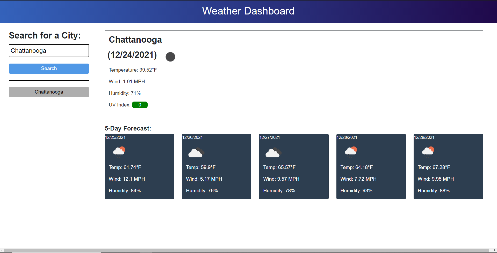

# Weather Dashboard

[Deployed Application](https://ericcrain77.github.io/weather-dashboard/)

[GitHub Repository](https://github.com/Ericcrain77/weather-dashboard)

## Table of Contents
* [Description](#description)
* [User Story](#user-story)
* [Screenshots](#screenshots)
* [Technologies](#technologies)
* [Questions](#questions)

## Description

A browser based weather dashboard that dynamically updates when you search for the weather conditions of different cities. 

## USER STORY

AS A traveler

I WANT to see the weather outlook for multiple cities

SO THAT I can plan a trip accordingly

## Screenshot

## Technologies
This application utilizes the following:
* Moment.js
* One Call API

## Questions
Reach out to me using my [Github account](https://github.com/Ericcrain77) or my [email](ericcrain77@gmail.com).